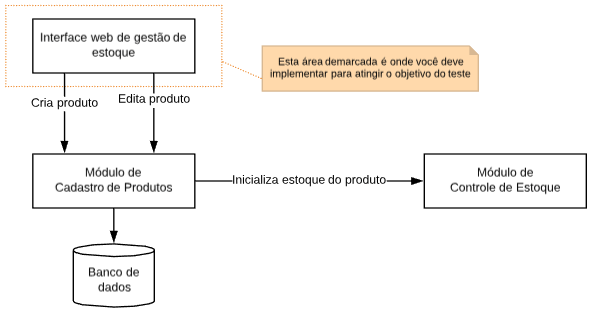

Olá!

O código que você está recebendo é a implementação de uma visualização simples de um Cadastro de Produtos.

Nesta visualização, você terá uma lista de produtos contendo nome, valor e foto.

A API que provê informações para esta visualização já está implementada e com a rota de GET sendo consumida. Os dados gerados são aleatórios, e eventualmente uma imagem pode não estar disponível no momento da consulta ou não ter o tamanho adequado.

Para disponibilizar uma nova funcionalidade para o usuário, gostaríamos que você implementasse o Formulário de Cadastro de um novo produto. A rota na API já está pronta para utilização:

POST /products
Payload: name (string), value (número) e imageUrl (string)

Além disso, gostaríamos que você utilizasse o tempo restante para melhorar o código e/ou a camada de apresentação já existente. Para isso fique à vontade para escolher o que você considera mais importante e para utilizar o tempo que for necessário.

Boa sorte!